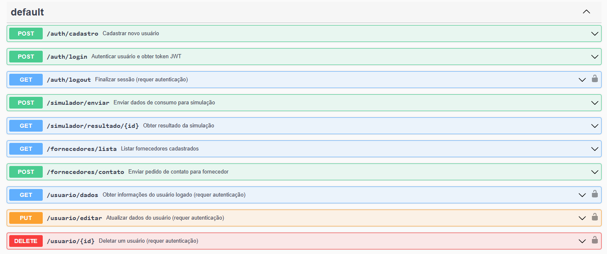

# API de Simulação de Energia Solar

Este projeto consiste em uma API RESTful desenvolvida em Python utilizando o framework Flask.
O objetivo principal é fornecer funcionalidades para o cadastro e autenticação de usuários,
simulação de viabilidade de energia solar com base nos dados de consumo, listagem de
fornecedores do setor e gerenciamento de informações do usuário.

## Tecnologias Utilizadas

* **Python:** A linguagem de programação principal utilizada no backend.
* **Flask:** Um microframework web para Python, utilizado para construir a API.
* **Flask-SQLAlchemy:** Uma extensão Flask que facilita a interação com bancos de dados
  relacionais através do SQLAlchemy ORM.
* **SQLite:** O banco de dados padrão configurado para desenvolvimento. (Pode ser
  facilmente alterado para outros bancos de dados suportados pelo SQLAlchemy).
* **JWT (JSON Web Tokens):** Utilizado para autenticação e autorização de usuários,
  garantindo a segurança das rotas protegidas.
* **Numpy:** Utilizado para calculos matematicos e estatisticos
* **Swagger/OpenAPI:** Utilizado para a documentação da API, facilitando a compreensão
  e o consumo por desenvolvedores frontend e outros clientes.
* **Postman:** Uma ferramenta útil para testar os endpoints da API.

## Rotas da API

A API Flask expõe os seguintes endpoints para o frontend consumir os dados:

**/auth: Rotas de Autenticação**

POST /auth/cadastro: Cadastra um novo usuário.

POST /auth/login: Autentica um usuário e retorna um token JWT.

GET /auth/logout: Finaliza a sessão do usuário (requer autenticação).

**/simulador: Rotas para Simulação**

POST /simulador/enviar: Recebe os dados de consumo do usuário para iniciar a simulação.

GET /simulador/resultado/&lt;id>: Retorna os cálculos do comparativo da simulação para um ID específico.

**/fornecedores: Rotas para Fornecedores**

GET /fornecedores/lista: Retorna uma lista de fornecedores cadastrados.

POST /fornecedores/contato: Envia um pedido de contato para um fornecedor específico.

**/usuario: Rotas do Usuário**

GET /usuario/dados: Retorna as informações do usuário logado (requer autenticação).

PUT /usuario/editar: Atualiza os dados do usuário logado (requer autenticação).

DELETE /usuario/&lt;id>: Deleta um usuário específico (requer autenticação).


**/swagger: Rotas de Documentação (Swagger UI)**
GET /swagger: Exibe a interface Swagger UI para visualizar e interagir com a API.

GET /swagger/swagger.yaml: Retorna o arquivo de especificação OpenAPI (YAML) da API.

## Documentação da API (Swagger UI)

A documentação completa da API, incluindo os parâmetros de requisição, os formatos de
resposta e os códigos de status, está disponível através do Swagger UI. 
A interface Swagger UI permite explorar os endpoints da API, entender seus requisitos
e até mesmo fazer requisições diretamente para testar as funcionalidades.



---

# Frontend

Esta seção explica o uso do frontend construído para consumir a API.

## Estrutura do Frontend

O frontend é dividido em páginas estáticas HTML, estilizadas com CSS e interativas com JavaScript (jQuery e Chart.js).

### Página Inicial

Contém o menu principal, seção de vantagens, avaliações e botões para login e cadastro.

### Dashboard

- Contém menu com os links Dashboard, Fornecedores e Início.  
- Área principal com abas:  
  - **Enviar Simulação:** formulário para inserir consumos e tarifa e enviar para a API.  
  - **Visualizar Resultados:** lista de simulações anteriores, tabela detalhada e gráficos.  
- Botões extras:  
  - Ajuda para uso do simulador.  
  - Explicações detalhadas de cada coluna da tabela.  
  - Gerar PDF com tabela e gráfico (inclui gráfico convertido em imagem no PDF).  
- Funcionalidade de logout limpa o token e redireciona à página inicial.

### Página Fornecedores

- Menu igual ao dashboard.  
- Lista estilizada de fornecedores com nome, telefone e email.  
- Botão para abrir modal de contato com o fornecedor.  
- Modal permite enviar mensagem para fornecedor via backend.

## Principais Tecnologias no Frontend

* **jQuery:** Para manipulação DOM e requisições AJAX com token JWT.  
* **Chart.js:** Para gráficos dinâmicos (barras no resultado e linhas em projeções).  
* **jsPDF + jsPDF-AutoTable + html2canvas:** Para geração de PDF com tabelas e gráfico incorporado.  
* **CSS com variáveis e responsividade:** Seguindo padrão visual consistente com o design geral.  

## Fluxo de autenticação e segurança

- Após login, o token JWT é salvo em `localStorage` e enviado em `Authorization: Bearer <token>` em todas requisições protegidas.  
- Decorações de rotas no backend usam `@jwt_required()` garantindo que só usuários autenticados acessem recursos sensíveis.  
- O logout remove o token localmente e pode disparar rota backend opcional para confirmação.  

## Exemplos de chamadas AJAX protegidas no frontend

```js
$.ajax({
  url: 'http://localhost:5000/simulador/lista',
  method: 'GET',
  headers: {'Authorization': 'Bearer ' + localStorage.getItem('token')},
  success: function(data) { /* ... */ },
  error: function(xhr) {
    if(xhr.status === 401) {
      // tratar token inválido ou expirado
    }
  }
});